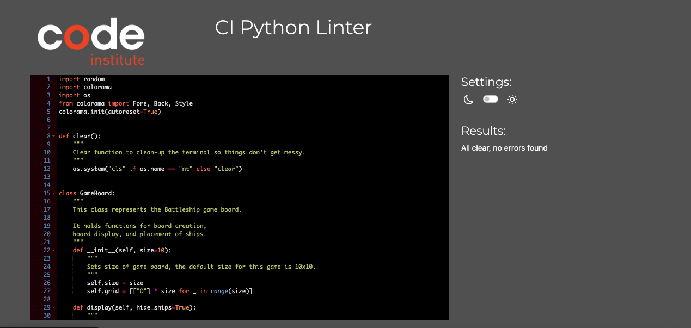

# Battleships

## Welcome to Battleships!

[Link to Live Site](https://battleships-lgau.onrender.com/)

## Introduction 

Welcome to Battleships a turn-based command-line strategy game that challenges the user to face an AI on the oceanic battlefield, trying to destroy each others fleet up until the last ship to decide a winner. Players will take turns in guessing coordinates on a board that is 10 x 10 in size, and hitting 5 ships, one of each size 1, 2, 3, 4, and 5. The game is complete and ends when one player has defeated the opponenets entire fleet successfuly. S marks ships, X marks hits, and M marks misses to visually inform the user of what is going on, on the battlefield. There are also hit, sunk, or miss user messages to inform what has happened verbally. 

Throughout development, I focused on optimizing ship placement algorithms to prevent overlap, refining input validation for seamless user interaction, and implementing a structured game loop to ensure smooth execution. While this version of Battleship is built for the terminal, the modular design allows for potential expansion into a graphical interface or online multiplayer adaptation. This project reflects my ability to break down a problem, write clean and scalable code, and iteratively improve functionality through rigorous testing and debugging.

## Table of Content

- [Battleships](#battleships)
  - [Table of Content](#table-of-content)
  - [User Stories](#user-stories)
    - [1. User Story 1:](#1-user-story-1)
    - [2. User Story 2:](#2-user-story-2)
    - [3. User Story 3:](#3-user-story-3)
    - [4. User Story 4:](#4-user-story-4)
  - [Features](#features)
    - [User Board](#user-board)
    - [Computer Board](#computer-board)
    - [Intro](#intro)
    - [End Game](#end-game)
  - [Styles](#styles)
    - [Color Schemes](#color-schemes)
      - [Red Foreground](#red-foreground)
      - [Green Foreground and Background](#green-foreground-and-background)
  - [Syntax](#syntax)
  - [Function Flow](#function-flow)
  - [Technologies Used](#technologies-used)
    - [Languages](#languages)
    - [Libraries \& Modules](#libraries--modules)
    - [Platforms \& Tools](#platforms--tools)
  - [Credits](#credits)
  - [Testing](#testing)
    - [General Testing](#general-testing)
    - [Mobile and Tablet Testing](#mobile-and-tablet-testing)
  - [Bugs](#bugs)
  - [Future Features](#future-features)
  - [New Applied Functions and Features Learned](#new-applied-functions-and-features-learned)
    - [1. if __name__ == "__main__":](#1-if-name--main)
    - [2. clear()](#2-clear)
    - [3. colorama](#3-colorama)
    - [4. colorama autoreset=true](#4-colorama-autoresettrue)
    - [5. Throwaway Variable](#5-throwaway-variable)
    - [6. ValueError](#6-valueerror)
    - [7. random.choice](#7-randomchoice)
    - [8. del()](#8-del)
    - [9. Python Dictionairies](#9-python-dictionairies)
    - [10. all()](#10-all)
  - [Deployment](#deployment)
    - [Cloning Repository](#cloning-repository)
    - [Fork](#fork)
    - [Local Deployment](#local-deployment)
    - [Python Webserver Port](#python-webserver-port)
    - [Clone to VS Code from GitHub](#clone-to-vs-code-from-github)
    - [Render Deployment](#render-deployment)

## User Stories 

### 1. User Story 1: 

I want to be able to challenge myself in a turn-based Battleship strategy game against a computer, and have a engaging time through the user friendly layout and simple game design.

- Acceptance Criteria:
  
  * The game has to alternate between player and computer
  * The player must be able to input 2 numbers for coordinates 
  * The game should inform the user whether attack was hit, miss, or sunk a ship
  * The game is over once all ships on either side are destroyed

- Key Tasks:

  * Implement function that accepts and validates user input
  * Program computer logic for effective AI guesses
  * Update game board every turn to reflect game progress

### 2. User Story 2: 

As a player I want to be able to get information, feedback, and visually clear instrunctions to the game for optimal user experience. 

- Acceptance Criteria:
  
  * The board should display different symbols/letters indicating hits, misses, and empty slots
  * Different game events should be color coded intuitively to get instant user feedback and response
  * The instrunctions should be displayed for a clear game approach

- Key Tasks:

  * Integrate colorama to color code specific game events
  * Update game board to symbollicaly display different game events 
  * Ensure clear and readable terminal output for optimal user experience
  * Display instructions at the start of the game 

### 3. User Story 3: 

As a user I want the computer to be able to place its ships differently each game, so that each game is unique and without overlap

- Acceptance Criteria:
  
  * The computer should place its 5 differently sized ships at the beginning of the game
  * Ships should either be displayed horizontally or vertically for variety
  * Ships may not cross each other

- Key Tasks:

  * Develop function that creates board-size valid coordinates
  * Ensure said function makes sure space is available before placing its ships
  * Store the ship locations for accurate ship placement

### 4. User Story 4: 

As a player I want to be informed of when all ships are sunk on either side, determining and displaying a winner. 

- Acceptance Criteria:
  
  * The game has to track the number of hits of all ships
  * When the entire ship is destroyed, the game has to indicate to the user that the ship has sunk
  * Once all ships are sunk on either side, the game should display the winner

- Key Tasks:

  * Integrate feature that tracks every hit per ship
  * Display user message when an entire ship has been destroyed
  * End game and display user message that announces a winner 

## Features 

### User Board

Below you will find an image of how the users board would be displayed. The player should be able to see where their ships are located without the computer knowing their location.

### Computer Board

Below you will find a picture of the computers game board, that at first appears to be empty, but in reality, they are hidden so the user can not see them, otherwise it would make the game far too easy, reducing the quality of the user experience. 

### Intro

Below is an image of the intro text displayed once the game is run with a welcome message as well as a simple breakdown of the rules and cues.

### End Game

Below you will find the display message that appears the moment someone wins/loses. If the computer wins it is red, since the user lost, but if the user wins, it is green.

## Styles

Since this project was a lot less design heavy then the first two, the Style section of this README is very limited to my knowledge and my capacity, but through the help of my mentor I learned about colorama which helped me make the most of styling the game. Through the use of colorama I was able to get a message to the user by solely using visual cues that are colored in an intuitive way. 

### Color Schemes

Although color schemes are intuitive, with such simple colors, and limited choices, the intuitive options increase, since another viable option would have been to mark all of the successful computer ship hits as red foreground, and the computer sinking your ship as red background, and only using green foreground and background for the players hits and sinks. This would have arguably been better than the stylistic choices I might have made here, but something like that would have to be tested on an open market to get successful and reliable results. 

#### Red Foreground

Below you will find the visual depiction of how I used the red color of colorama

The red colored lettering for the "Miss" user message is the only red in the game indicating a miss, making it visually very clear what has happened.

#### Green Foreground and Background

Below you will find the visual depiction of how I used the green color of colorama

The green colored lettering for one, and the green background for the other user message is a clear indication of the opposite spectrum. It very intuitively tells the user that someone successfuly made something happen. In this case it is hitting or sinking a ship.

## Syntax 

Below you will find an image of results on this projects linter

## Function Flow

Below you will find a flow chart of the functions

## Technologies Used 

### Languages 

1. [Python](https://www.python.org/)

    * Entire codebase, but also used the website for educational content

### Libraries & Modules

1. [Colorama](https://pypi.org/project/colorama/)

    * Coloring 

2. [Youtube](https://www.youtube.com/playlist?list=PL-osiE80TeTt2d9bfVyTiXJA-UTHn6WwU)

    * Used this playlist in order to understand certain concepts I was not able to grasp in the lessons

### Platforms & Tools

1. [Github](https://github.com/)

    * Storing code remotely

2. [VS Code](https://www.gitpod.io/)

    * IDE for project developemnt 

3. [Copilot](https://github.com/features/copilot)

    * AI for code optimization, cleanliness, and efficiency 

3. [Render](https://render.com/)

    * Deployment

## Credits 

1. [Code Inspiration & Logic](https://www.youtube.com/watch?v=tF1WRCrd_HQ&t=1s)

    * Used this as an inspiration for my project as well as overall game logic 

## Testing 

### General Testing 

Testing this time around was very simple, easy, and straightforward. Since we were using only one language for this project, as well as it having been a simpler one, leads to the fact that certain aspects of this README are not as elaborate as other README files that I have done. It is possible because I do not know the scope all testing possibilities across all languages, but I tried my best to cover what I knew and what I thought was important.

This time around I used print() more than ever before to check if what I was building, and the logic I was putting together, was making structural sense. I had to make sure, that for almost every line of code I was putting down, that I was extracting the correct information, placing the correct information, or storing/sending/returning the correct information, for the build to actually come together in the end. 
 
### Mobile and Tablet Testing

This program ran the exact same, bugs and all, regardless of which OS system, device, or browser I used. I tested it across multiple devices new gen as well as older generation. Everything from the display of the terminal, to the color coding of the colorama, and the way the game interacted, as well as prompt validation and more all worked in the exact same manner.

## Bugs

1. Correctly placing clear() function in code (fixed & unfixed)

    * I was/am getting issues with the display after deployment and where the clear function starts cutting off or clearing the text in places where its either aesthetically not ideal, or it hinders the game from being playable due to the limited display of the current round. 
    
    * Since I am deploying on Render, and the result was consistently different after deployment as to how the terminal turned out by using the clear() function, I was unsure on how to fix this issue post deployment as I was unsure why my code was coming out perfect in my terminal in my IDE, but then got messed up visually by the clear() function when running the program on the deployed site on Render. Essentialy it removed everything it needed to, just like it was supposed to except for the first two rows of the user board and its title "User Board:", creating an awkward layering of correct as well as incorrect output. Since testing this was extremely time consuming, inefficient, and frustrating, I have not been able to figure out exactly where to place the clear() function to get the desired result. I am hoping that upon further testing I will be able to find the right spot for it in my code. 

    * When inputting incorrect information into the prompt, once or several times, and then inputting the correct data, led to this issue worsening, for some reason showing more of the previous game play that should have been cleared from the terminal for a better user experience, instead this makes it much worse. 

    * Below you will find a picture of the issue that presents itself when deployed and how it is supposed to look (the "supposed to look" is the actual terminal window of my own VS Code, so I wonder what went wrong or why it is so different in deployment). From the VS Code terminal picture you can tell I already played 7 rounds to simulate the same error as in deployment, but it simply does not happen. 

    
    

2. Getting the ships not to overlap (fixed)

    * The most difficult function of this entire code for me was the place_ships function. It took me the longest to make sense of, and it took the most trial and error through seeing the results with print(). The were often stacking over each other, sometimes even more than just 2. After a while I was able to figure out a sort of detection loop to figure out if a ship has been previously placed there. 

3. Winner not being detected or displayed (fixed)

    * I was not able to access the dictionairy I created which meant I was not able to manipulate or remove ships once they have been sunk and my code was relying on that in order to detect a winner. I had to create a copy of the dictionairy so I would be able to delete original entries, while still iterating over the copy. Once I was able to access it, I was able to delete entire ships once they have been sunk successfully. Immediately after, my detection started working and a winner was displayed. 

4. Ship placement not very efficient or intelligent (unfixed)

    * Although it works, the issue is that at times, the randomized placement of the ships would be localized in a specific area e.g. all large ships in close vacinity, which would make the game too easy and hurt the quality of the user experience.

5. Script does not replay (unfixed)
    * Although I wanted to be able to prompt the user for a "replay", I did not have the capacity and the time to implement it as I was having issues with certain loops when trying to implement a function that would restart the game.

6. Inefficient display of board (unfixed)

    * It would have been a better user experience, due to creating a far better overview for the viewer if I would have had coordinates on the side of the board, displaying x row and x column in order to give the user more precision in their game strategy without having to count each step.

7. Board was not being targeted correctly (fixed)

    * Since python was not targeting my board correctly, always updating the symbols on the board off by one vertically and horizontally. I then remembered that Python uses 0-based indexing and I was able to figure out how to very easily target the correct space on the board.

8. Ability to input special characters or letters (fixed)

    * I had to add a ValueError exception with a custom message in order to fix the issue of the user being able to input any letter or special character causing the game to "skip" a turn, not function properly, or break.

## Future Features

1. A more intelligent AI that directs its attacks logically around successful hits
2. A multiplayer mode that allows player 1 vs player 2 gameplay
3. Intergrate different difficulty levels
4. Using a GUI framework for a more visual experience
5. Replay option allowing the player to restart the game instead of rerunning the script
6. Implementing a score tracking feature
7. Adding ship symbols for user board
8. Allowing the user to choose a custom board size and/or difficulty
9. Allowing the user to place the ships themselves
10. Adding special abilities that give you advantages throughout the game
11. Implementing a turn countdown timer
12. Adding an "undo last move" option
13. Adding sound effects for better user experience
14. Being able to add your name as a user for a more personal experience
15. Implementing hits when a hit gets close to an enemies ship e.g. "You missed, but your shot rocked a boat nearby!"

## New Applied Functions and Features Learned

### 1. if __name__ == "__main__":
  * This condition ensures that specific blocks of code only execute when the script is run directly, preventing unintended execution when the script is imported elsewhere. I personally did not have this issue when trying things out with my code, but I put it in there anyway for an extra measure of safety.

### 2. clear()
  * Clears terminal window at a specific point creating a cleaner overview of the terminal and the way that the game is being printed, improving the quality of the user experience. 

### 3. colorama
  * This is a Python library that allows for colored terminal output, which allowed me to improve game play and elevate user experience through better visual cues. 

### 4. colorama autoreset=true
 * This feature ensured that color formatting resets automatically after each print statement, before adding this I had a bug in my code where everything was inconsistently colored across. 

### 5. Throwaway Variable
  * I learned about this while watching educational videos and I thought it would be interesting to apply to my code to see how it works. As I needed a variable but did not use it syntactically, I thought this could work. 

### 6. ValueError
  * Since this was arguably one of the most important aspects of my code (prompting user for the CORRECT input), I had to make sure nothing else could be an input apart from the numbers allowed in the game. This helped prevent program crashes from invalid input.

### 7. random.choice
  * I could not remember if this was in the lessons or not of the last modules, but I decided to add this to this list anyway cause I through it was a very practical and efficient little piece of a built in function.

### 8. del() 
  * This helped me delete ships once they have been destroyed by removing them from the dictionairy. Also a very practical function that would have been great to learn about in general.

### 9. Python Dictionairies
  * Although this was covered in the course content, I wanted to mention it again because coding this game forced me to have a far better understanding over dictionairies, how to access them, how to collect data, how to change or remove data, and how to use this data. 

### 10. all()
  * This is an incredibly useful function for validating conditions across multiple elements. It simplifies checking multiple conditions at once instead of using loops and if statements. It helped me ensure proper ship placement in the Battleship game by verifying that all required positions were available before placing a ship.

## Deployment 

### Cloning Repository 

1. Go to project repository [here](https://github.com/isidorocotugno5P/battleships)
2. Click on the green button labeled "Code" near the top right of the repository
3. Under the "Local" tab under the green button labeled "Code" copy the URL using HTTPS, make sure you are on the "HTTPS" beneath the "Local" tab of the green button labeled "<> Code"
4. You can choose to clone the repository with "SSH" or "GTIHub CLI" beneath the tabs labeled under each respective name
5. To copy each given URL click the copy button next to the URL under each given tab or highlight the URL itself and copy it directly
6. Open a terminal on your personal workspace on Github
7. Adapt and change the current working directory to the specific location where you would like your directory cloned
8. Into the terminal type in <code>git clone</code> and paste any of the URL you copied earlier
9. Press enter and your clone will be created

### Fork

1. Follow the previously given link to the given repository of this project
2. On the top right corner of the page you will see a dropdown button link labeled "Fork"
3. Press on it and you should see your own personal Github User ID assuming you have one
4. Click on your User ID to compute the fork
5. Now your browser should redirect you to the forked repository that should have been allocated in your own Github
6. Now if you view the dropdown button on the top right of your own Github organization labeled "Fork" the value should have increased by "1"
7. You have successfuly copied the original repository 

### Local Deployment

1. Once you have successfuly cloned or forked the repository it is time to locally deploy the website
2. Log into your own Github account, assuming that you have completed the previous steps you should have already had an account if you do not have an account please create one [here](https://github.com/). Once completed please follow the steps above for cloning or forking ideally before locally deploying the site.
3. Once you have made a clone or fork of your the linked repository above the repo should appear on the left hand side of your Github dashboard
4. Click on project repository
5. Click on the tabs labelled "Settings" to the right of the tab labelled "Insights"
6. On the left hand side of the Settings tab you will have to naviagte to the section called "Pages"
7. Once you have clicked on Pages you are going to have to set the "Source" to "Deploy from Branch", the "Main Branch", should be selected and the folder location has to be set to "/root"
8. Once all setting are set correctly press save and your website should be properly deployed
9. Return to the tab labelled "Code" on the same level you found the "Setting" tabs earlier, wait a few seconds or minutes, ideally refresh your repository, and your deployed website should be located on the right side of the repository under a section labelled "github-pages"
10. The given link should be an active link to your live website

### Python Webserver Port 

1. If you do not need a local deployment follow these steps in order to achieve a quick overview of the website
2. Once you have forked or cloned the linked repository, in your own github dashboard once you have clicked on the cloned or forked repository click on the green button labelled "Open" which will prompt your Github IDE workstation 
3. In the terminal type in <code>python3 -m http.server</code> to create a port
4. After a few seconds you should receive a pop up on the right of your workstation which will prompt you to make a choice on the deployed port.
5. To view the current version of the coded website click on the button labelled "Open Browser"
6. This is the current version of the website that has been coded, changed, adapted, or altered on the current repository you have cloned or forked, any saved changed will be adapted on this version of the website before you <code>git push</code> the code and deploy the website

### Clone to VS Code from GitHub

1. Before cloning the GitHub repo to VS Code make sure you have Git installed on your device. To check if you have Git on your device already, open your terminal and paste in <code>git --version</code>. If you do not have any please download Git from the official website [here](https://git-scm.com/)
2. If you do not have it already install VS Code [here](https://code.visualstudio.com/)
3. Launch VS Code
4. Open the terminal and paste the URL of the GitHub repository
  a. <code>https://github.com/isidorocotugno5P/battleships</code>
5. Choose a local directory where you would like to clone the repository
6. In the command palette type: ">GitHub: Sign in to GitHub"
7. Follow the prompts to sign in to your GitHub account
8. After opening the cloned repo you should now be able to change, commit, and push the changes to your own GitHub repository. 

### Render Deployment 

1. Visit [Render](https://render.com/), click "Get Started", and sign up for Render through GitHub
2. Log into GitHub if necessary and select "Authorize Render"
3. Confirm your email address and click "Complete Sign-Up"
4. Open your email and confirm through the verification link 
5. On your Render dashboard click "New+" and select "Web Service"
6. On the right of the page select "+ Connect Account" for GitHub
7. Select your GitHub account
8. Ensure "All Repositories" is selected and click "Install"
9. Search for relevant repository and click "Connect"
10. Add a name for your web service
11. Set the build command: <code>pip install -r requirements.txt && npm install</code>
12. Set the Start Command: <code>node index.js</code>
13. Ensure free plan is selected
14. Scroll down and click "Advanced"
15. Click "Add Environment Variable"
16. Add following environment variables 
  a. Key: PORT, Value: 8000
  b. Key: PYTHON_VERSION, Value: 3.10.7
17. Set preferred choice for auto-deployment
18. Click "Create Web Service" and wait for deployment